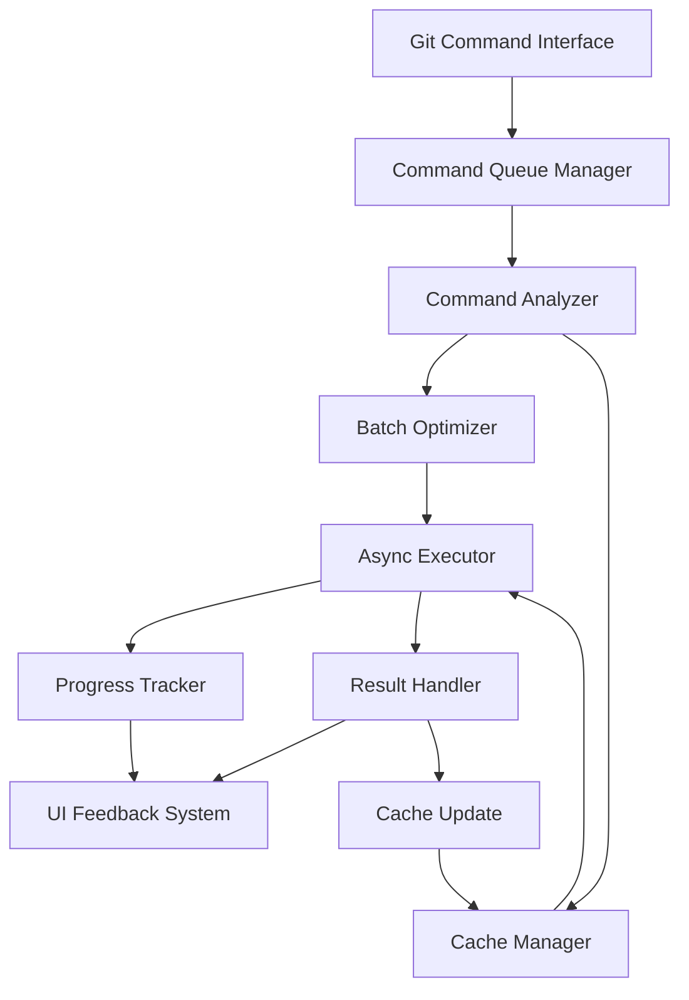

# Git Command Optimization Design

## Overview

This design implements an asynchronous git command processing system that optimizes developer workflow by eliminating blocking operations, providing real-time feedback, and intelligently managing git operations. The system will be built as a service layer that intercepts git commands and processes them through an optimized pipeline.

## Architecture

### Core Components



### System Layers

1. **Command Interface Layer** - Intercepts git commands from IDE/CLI
2. **Processing Layer** - Analyzes, optimizes, and queues commands
3. **Execution Layer** - Handles asynchronous execution with progress tracking
4. **Feedback Layer** - Provides real-time updates to the user interface
5. **Cache Layer** - Manages intelligent caching of git data

## Components and Interfaces

### GitCommandManager
```typescript
interface GitCommandManager {
  executeCommand(command: GitCommand): Promise<GitResult>
  batchCommands(commands: GitCommand[]): Promise<GitResult[]>
  getCommandStatus(commandId: string): CommandStatus
  cancelCommand(commandId: string): boolean
}
```

### CommandQueue
```typescript
interface CommandQueue {
  enqueue(command: GitCommand): string // returns command ID
  dequeue(): GitCommand | null
  peek(): GitCommand | null
  getQueueStatus(): QueueStatus
}
```

### BatchOptimizer
```typescript
interface BatchOptimizer {
  analyzeBatchability(commands: GitCommand[]): BatchAnalysis
  createBatch(commands: GitCommand[]): BatchedCommand
  canCombine(cmd1: GitCommand, cmd2: GitCommand): boolean
}
```

### ProgressTracker
```typescript
interface ProgressTracker {
  startTracking(commandId: string): void
  updateProgress(commandId: string, progress: ProgressInfo): void
  completeTracking(commandId: string, result: GitResult): void
  getProgress(commandId: string): ProgressInfo
}
```

### CacheManager
```typescript
interface CacheManager {
  get(key: string): CachedResult | null
  set(key: string, value: any, ttl: number): void
  invalidate(pattern: string): void
  isStale(key: string): boolean
}
```

## Data Models

### GitCommand
```typescript
interface GitCommand {
  id: string
  type: GitCommandType
  args: string[]
  workingDirectory: string
  priority: CommandPriority
  timeout: number
  retryConfig: RetryConfig
  metadata: CommandMetadata
}
```

### GitResult
```typescript
interface GitResult {
  commandId: string
  success: boolean
  output: string
  error?: string
  executionTime: number
  fromCache: boolean
  metadata: ResultMetadata
}
```

### ProgressInfo
```typescript
interface ProgressInfo {
  commandId: string
  stage: ExecutionStage
  percentage: number
  currentOperation: string
  estimatedTimeRemaining?: number
  transferProgress?: TransferProgress
}
```

### CacheEntry
```typescript
interface CacheEntry {
  key: string
  value: any
  timestamp: number
  ttl: number
  dependencies: string[]
}
```

## Error Handling

### Timeout Management
- Configurable timeouts per command type
- Progressive timeout extension options
- Graceful cancellation with cleanup

### Retry Logic
- Exponential backoff for network-related failures
- Command-specific retry strategies
- Maximum retry limits with fallback options

### Error Recovery
- Automatic cache invalidation on errors
- Rollback mechanisms for failed batch operations
- User-friendly error messages with suggested actions

### Failure Scenarios
1. **Network timeouts** - Retry with exponential backoff
2. **Repository locks** - Queue commands and retry when lock is released
3. **Authentication failures** - Prompt for credential refresh
4. **Disk space issues** - Alert user and suggest cleanup actions

## Testing Strategy

### Unit Testing
- Command parsing and validation
- Batch optimization algorithms
- Cache hit/miss scenarios
- Progress calculation accuracy
- Error handling edge cases

### Integration Testing
- End-to-end command execution flows
- Cache invalidation across operations
- Concurrent command handling
- Network failure simulation
- Large repository performance

### Performance Testing
- Command execution benchmarks
- Memory usage under load
- Cache effectiveness metrics
- Concurrent operation limits
- Network bandwidth optimization

### User Experience Testing
- Progress indicator accuracy
- Response time improvements
- Error message clarity
- Cancellation responsiveness
- Batch operation feedback

## Implementation Considerations

### Performance Optimizations
- Command deduplication in queue
- Intelligent cache warming
- Background cache refresh
- Connection pooling for network operations
- Memory-efficient progress tracking

### Security Considerations
- Secure credential handling
- Command injection prevention
- Safe command cancellation
- Audit logging for sensitive operations

### Configuration Management
- Per-repository settings
- Global default configurations
- Environment-specific overrides
- Runtime configuration updates

### Monitoring and Observability
- Command execution metrics
- Cache hit rates
- Error frequency tracking
- Performance degradation alerts
- User interaction analytics