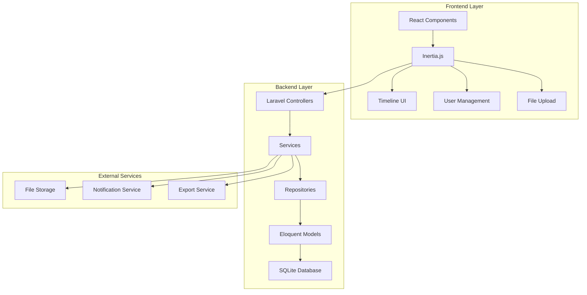

# Design Document

## Overview

The Co-Parenting Timeline system is built as a Laravel 12.28.1 application with React 19.1.1 and Inertia.js 2.0.6, providing a seamless single-page application experience. The system enables separated parents and authorized consultants to maintain a shared timeline of parenting activities, logistics coordination, and professional consultations.

**Current Implementation Status:** The application has basic authentication (Laravel Breeze), a simple timeline display, and basic CRUD operations for timeline items. The foundation is solid but requires significant enhancement to meet all requirements.

The architecture follows Laravel's MVC pattern on the backend with a React-based frontend, leveraging Inertia.js for server-side rendering and seamless data flow between Laravel and React components.

## Architecture

### High-Level Architecture



### Technology Stack

- **Backend**: Laravel 12.28.1 with PHP 8.4.12
- **Frontend**: React 19.1.1 with TypeScript
- **Bridge**: Inertia.js 2.0.6 (Laravel) / 2.1.2 (React)
- **Database**: SQLite (current), PostgreSQL (production recommended)
- **Styling**: Tailwind CSS 4.1.12
- **Testing**: Pest 4.1.0
- **Code Quality**: Laravel Pint 1.24.0, ESLint 9.33.0, Prettier 3.6.2
- **Package Manager**: Bun (replaces npm for all JavaScript package management)
- **Permissions**: Spatie Permission package (installed but not fully configured)
- **Routing**: Laravel Wayfinder 0.1.12 for type-safe routing

## Components and Interfaces

### Backend Components

#### Models

**User Model (Current + Enhancements Needed)**
```php
// Current implementation uses Laravel Breeze + Spatie Permission
class User extends Authenticatable
{
    use HasFactory, Notifiable, HasRoles; // ✅ Already implemented
    
    protected $fillable = [
        'name', 'email', 'password', // ✅ Current
        'family_id', 'professional_credentials', 'notification_preferences' // ❌ Need to add
    ];
    
    protected $casts = [
        'email_verified_at' => 'datetime', // ✅ Current
        'password' => 'hashed', // ✅ Current
        'notification_preferences' => 'array', // ❌ Need to add
        'professional_credentials' => 'array' // ❌ Need to add
    ];
    
    // ❌ Need to add these relationships
    public function family(): BelongsTo;
    public function timelineItems(): HasMany;
    public function notifications(): HasMany;
}
```

**Family Model (Needs Implementation)**
```php
// ❌ Currently empty - needs full implementation
class Family extends Model
{
    protected $fillable = ['name', 'child_name', 'created_by'];
    
    public function users(): HasMany;
    public function timelineItems(): HasMany;
    public function calendarEvents(): HasMany;
}
```

**TimelineItem Model (Current + Enhancements Needed)**
```php
class TimelineItem extends Model
{
    protected $fillable = [
        'user_id', 'author', 'title', 'content', 'date', 'item_timestamp', 'category', 'tags', // ✅ Current
        'family_id', 'is_urgent', 'attachments', 'linked_items' // ❌ Need to add
    ];
    
    protected $casts = [
        'tags' => 'array', // ✅ Current
        'date' => 'date', // ✅ Current
        'item_timestamp' => 'datetime', // ✅ Current
        'attachments' => 'array', // ❌ Need to add
        'linked_items' => 'array', // ❌ Need to add
        'is_urgent' => 'boolean' // ❌ Need to add
    ];
    
    public function user(): BelongsTo; // ✅ Current
    public function family(): BelongsTo; // ❌ Need to add
    public function comments(): HasMany; // ❌ Need to add
}
```

**CalendarEvent Model**
```php
class CalendarEvent extends Model
{
    protected $fillable = [
        'family_id', 'created_by', 'title', 'description',
        'start_date', 'end_date', 'location', 'attendees', 'status'
    ];
    
    protected $casts = [
        'start_date' => 'datetime',
        'end_date' => 'datetime',
        'attendees' => 'array'
    ];
}
```

#### Controllers

**TimelineController (Current + Enhancements Needed)**
- `index()`: ✅ Basic implementation exists - needs filtering and family-based access
- `store()`: ❌ Need to implement - Create new timeline item and redirect with Inertia
- `update()`: ❌ Need to implement - Update existing item and return Inertia response
- `destroy()`: ❌ Need to implement - Delete item and redirect with Inertia
- `export()`: ❌ Need to implement - Generate PDF export and return file download

**CalendarController**
- `index()`: Return Inertia response with calendar events
- `store()`: Create new event and redirect with Inertia
- `update()`: Update event and return Inertia response
- `respond()`: Respond to event invitation with Inertia redirect

**NotificationController**
- `index()`: Return Inertia response with user notifications
- `markAsRead()`: Mark notifications as read via Inertia form
- `updatePreferences()`: Update notification settings with Inertia redirect

#### Services

**TimelineService**
```php
class TimelineService
{
    public function createItem(array $data, User $user): TimelineItem;
    public function getFilteredItems(Family $family, array $filters): Collection;
    public function exportTimeline(Family $family, array $filters): string;
    public function linkItems(TimelineItem $item, array $linkedIds): void;
}
```

**NotificationService**
```php
class NotificationService
{
    public function notifyNewItem(TimelineItem $item): void;
    public function notifyUrgentItem(TimelineItem $item): void;
    public function sendReminders(): void;
}
```

**FileService**
```php
class FileService
{
    public function uploadAttachment(UploadedFile $file, TimelineItem $item): array;
    public function deleteAttachment(string $path): bool;
    public function generateThumbnail(string $path): string;
}
```

### Frontend Components

#### Core Components

**Timeline Component (Current + Enhancements Needed)**
```typescript
// ✅ Basic component exists but needs enhancement
interface TimelineProps {
  items: TimelineItem[]; // ✅ Current
  currentUser: User; // ⚠️ Currently using mock data
  filters?: TimelineFilters; // ❌ Need to add
  onFilterChange?: (filters: TimelineFilters) => void; // ❌ Need to add
  onItemUpdate?: (item: TimelineItem) => void; // ❌ Need to add
}

const Timeline: React.FC<TimelineProps> = ({ ... }) => {
  // ✅ Basic timeline display exists
  // ❌ Need to add filtering, search, and real-time updates
  // ❌ Need to replace mock data with Inertia.js data flow
};
```

**TimelineItem Component (Enhanced)**
```typescript
interface TimelineItemProps {
  item: TimelineItem;
  currentUser: User;
  onUpdate: (item: TimelineItem) => void;
  onDelete: (id: string) => void;
  onLink: (linkedItems: string[]) => void;
}

const TimelineItem: React.FC<TimelineItemProps> = ({ ... }) => {
  // Enhanced item with attachments, linking, and comments
};
```

**FilterPanel Component**
```typescript
interface FilterPanelProps {
  filters: TimelineFilters;
  onFilterChange: (filters: TimelineFilters) => void;
  categories: string[];
  tags: string[];
}

const FilterPanel: React.FC<FilterPanelProps> = ({ ... }) => {
  // Advanced filtering with date ranges, categories, tags, and search
};
```

**AttachmentUpload Component**
```typescript
interface AttachmentUploadProps {
  onUpload: (files: File[]) => void;
  maxFiles: number;
  acceptedTypes: string[];
}

const AttachmentUpload: React.FC<AttachmentUploadProps> = ({ ... }) => {
  // Drag-and-drop file upload with preview and validation
};
```

**CalendarView Component**
```typescript
interface CalendarViewProps {
  events: CalendarEvent[];
  onEventCreate: (event: Partial<CalendarEvent>) => void;
  onEventUpdate: (event: CalendarEvent) => void;
  currentUser: User;
}

const CalendarView: React.FC<CalendarViewProps> = ({ ... }) => {
  // Shared calendar with event management
};
```

#### Layout Components

**AppLayout (Enhanced)**
- Navigation with timeline/calendar toggle
- User role indicator
- Notification badge
- Family context switcher (for consultants)

**TimelineLayout**
- Sidebar with filters
- Main timeline area
- Quick action buttons
- Export options

## Data Models

### Database Schema

```sql
-- ✅ Users table exists with basic auth fields
-- ❌ Need to add these columns to existing users table
ALTER TABLE users ADD COLUMN family_id INTEGER;
ALTER TABLE users ADD COLUMN professional_credentials JSON;
ALTER TABLE users ADD COLUMN notification_preferences JSON;

-- ✅ Families table exists but is empty - need to add columns
ALTER TABLE families ADD COLUMN name VARCHAR(255) NOT NULL;
ALTER TABLE families ADD COLUMN child_name VARCHAR(255) NOT NULL;
ALTER TABLE families ADD COLUMN created_by INTEGER NOT NULL;
ALTER TABLE families ADD FOREIGN KEY (created_by) REFERENCES users(id);

-- ✅ Timeline Items table exists with basic fields
-- ❌ Need to add these columns to existing timeline_items table
ALTER TABLE timeline_items ADD COLUMN family_id INTEGER;
ALTER TABLE timeline_items ADD COLUMN is_urgent BOOLEAN DEFAULT FALSE;
ALTER TABLE timeline_items ADD COLUMN attachments JSON;
ALTER TABLE timeline_items ADD COLUMN linked_items JSON;
ALTER TABLE timeline_items ADD FOREIGN KEY (family_id) REFERENCES families(id);

-- ❌ Need to create these new tables
CREATE TABLE calendar_events (
    id INTEGER PRIMARY KEY AUTOINCREMENT,
    family_id INTEGER NOT NULL,
    created_by INTEGER NOT NULL,
    title VARCHAR(255) NOT NULL,
    description TEXT,
    start_date DATETIME NOT NULL,
    end_date DATETIME,
    location VARCHAR(255),
    attendees JSON,
    status ENUM('pending', 'confirmed', 'cancelled') DEFAULT 'pending',
    created_at DATETIME,
    updated_at DATETIME,
    FOREIGN KEY (family_id) REFERENCES families(id),
    FOREIGN KEY (created_by) REFERENCES users(id)
);

-- ❌ Need to create notifications table
CREATE TABLE notifications (
    id INTEGER PRIMARY KEY AUTOINCREMENT,
    user_id INTEGER NOT NULL,
    type VARCHAR(255) NOT NULL,
    title VARCHAR(255) NOT NULL,
    message TEXT NOT NULL,
    data JSON,
    read_at DATETIME,
    created_at DATETIME,
    FOREIGN KEY (user_id) REFERENCES users(id)
);

-- ❌ Need to create comments table
CREATE TABLE comments (
    id INTEGER PRIMARY KEY AUTOINCREMENT,
    timeline_item_id INTEGER NOT NULL,
    user_id INTEGER NOT NULL,
    content TEXT NOT NULL,
    created_at DATETIME,
    updated_at DATETIME,
    FOREIGN KEY (timeline_item_id) REFERENCES timeline_items(id),
    FOREIGN KEY (user_id) REFERENCES users(id)
);
```

### TypeScript Interfaces

```typescript
interface TimelineItem {
  id: string;
  family_id: string;
  user_id: string;
  author: 'father' | 'mother' | 'consultant';
  title: string;
  content: string;
  date: string;
  timestamp: number;
  category: 'parenting' | 'logistics' | 'consultation' | 'other';
  tags: string[];
  is_urgent: boolean;
  attachments: Attachment[];
  linked_items: string[];
  comments: Comment[];
  created_at: string;
  updated_at: string;
}

interface Attachment {
  id: string;
  filename: string;
  original_name: string;
  mime_type: string;
  size: number;
  url: string;
  thumbnail_url?: string;
}

interface CalendarEvent {
  id: string;
  family_id: string;
  created_by: string;
  title: string;
  description?: string;
  start_date: string;
  end_date?: string;
  location?: string;
  attendees: string[];
  status: 'pending' | 'confirmed' | 'cancelled';
}

interface TimelineFilters {
  category?: string;
  tags?: string[];
  author?: string;
  dateRange?: {
    start: string;
    end: string;
  };
  search?: string;
  urgent_only?: boolean;
}

interface NotificationPreferences {
  email_enabled: boolean;
  push_enabled: boolean;
  urgent_only: boolean;
  digest_frequency: 'immediate' | 'daily' | 'weekly';
}
```

## Error Handling

### Backend Error Handling

**Custom Exception Classes**
```php
class TimelineException extends Exception {}
class UnauthorizedFamilyAccess extends TimelineException {}
class InvalidFileUpload extends TimelineException {}
class ExportGenerationFailed extends TimelineException {}
```

**Global Exception Handler**
```php
class Handler extends ExceptionHandler
{
    public function render($request, Throwable $exception)
    {
        if ($exception instanceof TimelineException) {
            return Inertia::render('Error', [
                'status' => 422,
                'message' => $exception->getMessage()
            ]);
        }
        
        return parent::render($request, $exception);
    }
}
```

### Frontend Error Handling

**Error Boundary Component**
```typescript
class TimelineErrorBoundary extends React.Component {
  constructor(props) {
    super(props);
    this.state = { hasError: false, error: null };
  }
  
  static getDerivedStateFromError(error) {
    return { hasError: true, error };
  }
  
  render() {
    if (this.state.hasError) {
      return <ErrorFallback error={this.state.error} />;
    }
    
    return this.props.children;
  }
}
```

**API Error Handling**
```typescript
const useTimelineApi = () => {
  const handleApiError = (error: any) => {
    if (error.response?.status === 403) {
      toast.error('You do not have permission to perform this action');
    } else if (error.response?.status === 422) {
      toast.error(error.response.data.message);
    } else {
      toast.error('An unexpected error occurred');
    }
  };
  
  return { handleApiError };
};
```

## Testing Strategy

### Backend Testing

**Feature Tests**
```php
class TimelineTest extends TestCase
{
    use RefreshDatabase;
    
    public function test_parent_can_create_timeline_item()
    {
        $user = User::factory()->parent()->create();
        $family = Family::factory()->create();
        $user->family()->associate($family);
        
        $response = $this->actingAs($user)
            ->post('/timeline', [
                'title' => 'Soccer Practice',
                'content' => 'Emma has practice today',
                'category' => 'logistics'
            ]);
            
        $response->assertRedirect();
        $this->assertDatabaseHas('timeline_items', [
            'title' => 'Soccer Practice',
            'user_id' => $user->id
        ]);
    }
    
    public function test_consultant_can_view_family_timeline()
    {
        // Test consultant access permissions
    }
    
    public function test_timeline_export_generates_pdf()
    {
        // Test PDF export functionality
    }
}
```

**Unit Tests**
```php
class TimelineServiceTest extends TestCase
{
    public function test_creates_timeline_item_with_attachments()
    {
        $service = new TimelineService();
        $user = User::factory()->create();
        
        $item = $service->createItem([
            'title' => 'Test Item',
            'content' => 'Test content',
            'category' => 'parenting'
        ], $user);
        
        $this->assertInstanceOf(TimelineItem::class, $item);
    }
}
```

### Frontend Testing

**Component Tests**
```typescript
describe('Timeline Component', () => {
  it('renders timeline items correctly', () => {
    const mockItems = [
      {
        id: '1',
        title: 'Test Item',
        content: 'Test content',
        author: 'father',
        category: 'parenting'
      }
    ];
    
    render(<Timeline items={mockItems} currentUser={mockUser} />);
    
    expect(screen.getByText('Test Item')).toBeInTheDocument();
  });
  
  it('filters items by category', () => {
    // Test filtering functionality
  });
  
  it('handles file uploads correctly', () => {
    // Test file upload component
  });
});
```

**Integration Tests**
```typescript
describe('Timeline Integration', () => {
  it('creates new timeline item and updates list', async () => {
    // Test full create flow
  });
  
  it('exports timeline data as PDF', async () => {
    // Test export functionality
  });
});
```

### API Testing

**Pest API Tests**
```php
it('returns paginated timeline items', function () {
    $user = User::factory()->parent()->create();
    $family = Family::factory()->create();
    TimelineItem::factory()->count(15)->create(['family_id' => $family->id]);
    
    $response = $this->actingAs($user)
        ->get('/api/timeline?page=1&per_page=10');
        
    $response->assertOk()
        ->assertJsonStructure([
            'data' => [
                '*' => ['id', 'title', 'content', 'author', 'created_at']
            ],
            'meta' => ['current_page', 'total', 'per_page']
        ]);
});

it('validates timeline item creation', function () {
    $user = User::factory()->parent()->create();
    
    $response = $this->actingAs($user)
        ->post('/api/timeline', []);
        
    $response->assertStatus(422)
        ->assertJsonValidationErrors(['title', 'content', 'category']);
});
```

This design provides a comprehensive foundation for building a robust co-parenting timeline application that addresses all the requirements while leveraging the existing Laravel and React infrastructure.